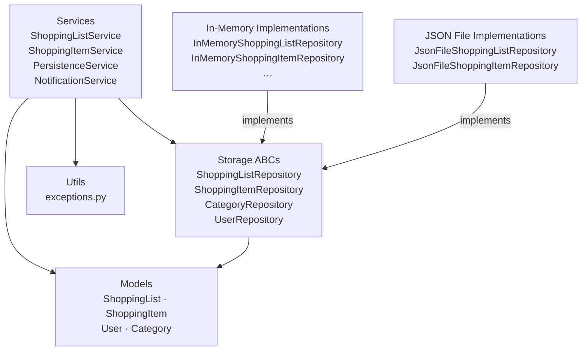
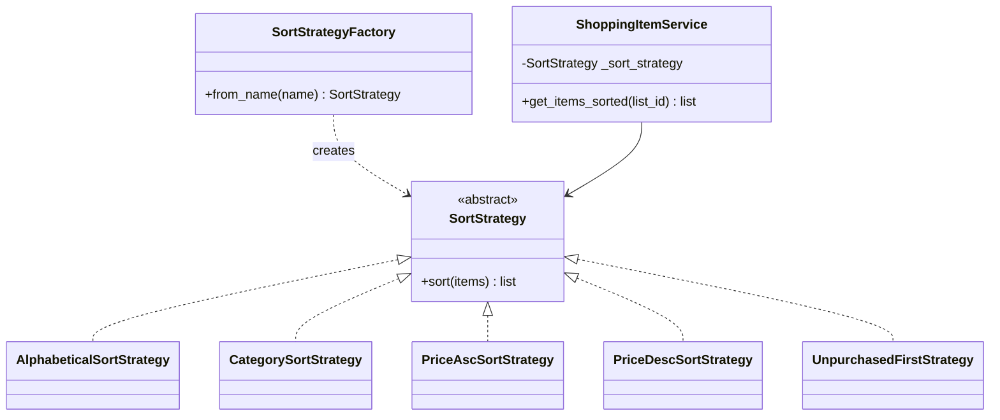
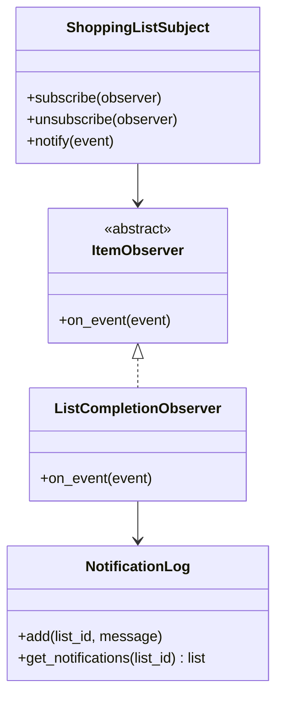

# Shopping List App

> An in-memory shopping list manager with pluggable sort strategies, JSON persistence, and an observer-driven completion notification — built in pure Python 3.12 with no external runtime dependencies.

[](https://github.com/Bushko6/shopping-list-app/actions/workflows/ci-pipeline.yml)
[](https://sonarcloud.io/summary/new_code?id=Bushko6_shopping-list-app)
[](https://sonarcloud.io/summary/new_code?id=Bushko6_shopping-list-app)
[](https://github.com/Bushko6/shopping-list-app/actions/workflows/ci-pipeline.yml)
[](https://www.python.org/downloads/release/python-3120/)

---

## Table of Contents

1. [Overview](#overview)
2. [Features](#features)
3. [Tech Stack](#tech-stack)
4. [Architecture](#architecture)
5. [Design Patterns](#design-patterns)
6. [Persistence](#persistence)
7. [Project Structure](#project-structure)
8. [Getting Started](#getting-started)
9. [CI/CD](#cicd)
10. [AI-Driven Setup](#ai-driven-setup)

---

## Overview

Shopping List App is a course project that demonstrates **clean architecture**, **SOLID principles**, and two classic GoF design patterns in a focused, dependency-free Python codebase.

- All state lives in **plain Python dicts/lists** (in-memory) or **JSON files** — no databases, no HTTP.
- Every dependency is **constructor-injected** — services never import concrete repos.
- 314 tests with **100 % branch coverage** enforce every rule at every layer.

---

## Features

| Feature | Details |
|---|---|
| **Manage lists** | Create and archive shopping lists per owner |
| **Manage items** | Add, remove, mark/unmark purchased, bulk-purchase all |
| **Pluggable sorting** | 5 strategies: alphabetical, category, price ↑, price ↓, unpurchased first |
| **Completion notification** | Observer fires automatically when every item on a list is purchased |
| **JSON persistence** | Drop-in `JsonFile*` repositories round-trip all fields through JSON |
| **TDD enforced** | Failing test before every line of production code; ≥ 85 % branch coverage required |

---

## Tech Stack

| Concern | Choice |
|---|---|
| Language | Python 3.12 |
| Test framework | pytest ≥ 8 |
| Coverage | pytest-cov ≥ 5 (branch coverage) |
| Mocking | pytest-mock ≥ 3.14 |
| Static analysis | SonarQube Cloud |
| CI | GitHub Actions |
| Containerisation | Docker (build / test stage) |

---

## Architecture

Dependency flow is strictly one-directional:



> `models/` imports nothing from this project. `utils/` imports nothing from `services/` or `storage/`.

---

## Design Patterns

### Strategy — Pluggable Sorting

Five concrete sort strategies implement a single `SortStrategy` ABC and are created by `SortStrategyFactory`. `ShoppingItemService` receives the strategy via constructor injection and never knows which concrete class it holds.



### Observer — Completion Notification

`ShoppingListSubject` holds a list of `ItemObserver` subscribers. After every `add_item` or `remove_item`, `ShoppingListService._check_completion` checks whether all items are purchased; if so it fires `LIST_COMPLETED`. `ListCompletionObserver` writes a message to `NotificationLog`, which `NotificationService` exposes to callers.



---

## Persistence

Two sets of repository implementations are available and are fully interchangeable via the ABC interface:

| Implementation | Storage | Use case |
|---|---|---|
| `InMemory*Repository` | Python `dict` in process memory | Unit / integration tests; default runtime |
| `JsonFile*Repository` | JSON file on disk | Persistence across sessions |

Switching is a one-line constructor change — no service code changes.

`PersistenceService` wraps both repository types with a unified `save` / `load` API that automatically calls `add` for new entities and `update` for existing ones.

---

## Project Structure

```
shopping-list-app/
├── src/
│   ├── models/                  # Pure data entities — import nothing from this project
│   │   ├── category.py          # Category dataclass
│   │   ├── enums.py             # ListStatus, SortOrder
│   │   ├── shopping_item.py     # ShoppingItem dataclass with validation
│   │   ├── shopping_list.py     # ShoppingList dataclass with is_archived / is_active
│   │   └── user.py              # User dataclass
│   ├── storage/
│   │   ├── interfaces.py        # Repository ABCs (ShoppingList, ShoppingItem, Category, User)
│   │   ├── memory/              # In-memory implementations
│   │   └── json_file/           # JSON-file implementations
│   ├── services/
│   │   ├── shopping_list_service.py   # Create/archive lists, add/remove items, fire events
│   │   ├── shopping_item_service.py   # Mark purchased, bulk purchase, sorted retrieval
│   │   ├── persistence_service.py     # Unified save/load facade
│   │   ├── notification_service.py    # Expose NotificationLog to callers
│   │   ├── sort_strategies.py         # SortStrategy ABC + 5 implementations + factory
│   │   └── observer.py                # ShoppingListSubject, ItemObserver, NotificationLog
│   └── utils/
│       └── exceptions.py        # Domain exception hierarchy
├── tests/
│   ├── unit/
│   │   ├── models/              # Dataclass validation tests
│   │   ├── services/            # Service tests with mocked repos
│   │   └── storage/             # Repository tests (in-memory + JSON)
│   └── integration/
│       ├── test_full_flow.py    # End-to-end: create → add → purchase → notification
│       ├── test_sort_scenarios.py     # All strategies with real repos
│       ├── test_persistence_scenario.py  # JsonFile save / reload
│       └── test_archive_scenario.py   # Archived list behaviour
├── docs/
│   ├── requirements.md          # Problem statement, actors, use cases
│   └── diagrams/
│       ├── use-case.md          # Mermaid use-case diagram
│       ├── domain-model.md      # Mermaid ER diagram
│       └── class-diagram.md     # Mermaid class diagram
├── .github/workflows/
│   └── ci-pipeline.yml          # Build → Test → SonarQube
├── .claude/skills/              # Claude Code skills (architecture, testing)
├── .cursorrules                 # Condensed AI-agent rules
├── CLAUDE.md                    # Full project context for Claude Code
├── Dockerfile                   # Build / test container
├── pyproject.toml               # Project metadata, pytest & coverage config
└── sonar-project.properties     # SonarQube Cloud configuration
```

---

## Getting Started

### Prerequisites

- Python 3.12+
- `pip`

### Install

```bash
pip install -e ".[dev]"
```

### Run all tests

```bash
pytest
```

### Run tests with branch coverage report

```bash
pytest --cov=src --cov-branch --cov-report=term-missing
```

### Full CI report (produces `coverage.xml`, `junit.xml`, `htmlcov/`)

```bash
pytest \
  --cov=src --cov-branch \
  --cov-report=term-missing \
  --cov-report=xml:coverage.xml \
  --cov-report=html:htmlcov \
  --junitxml=junit.xml
```

### Docker

```bash
docker build -t shopping-list-app .
docker run --rm shopping-list-app
```

---

## CI/CD

Every push to any branch and every pull request triggers the **CI** workflow:

```
Checkout → Set up Python 3.12 → Install deps
    → python -m compileall src          (build check)
    → pytest --cov … --junitxml …       (308 tests, 100 % branch coverage)
    → Upload artifacts (coverage.xml, junit.xml, htmlcov/)
    → SonarQube Cloud scan
```

Quality gate enforces: **0 bugs**, **0 vulnerabilities**, **coverage ≥ 85 %**, **maintainability A or B**.

---

## AI-Driven Setup

This project was developed with **Claude Code** as a pair-programming assistant. Two layered rule sets keep every AI suggestion aligned with the architecture:

| File | Scope | Purpose |
|---|---|---|
| `.cursorrules` | Always-on (Cursor) | Condensed hard rules: no concrete repo without ABC first, TDD only, constructor injection, no I/O in `src/`. |
| `CLAUDE.md` | Always-on (Claude Code) | Full project context: layer diagram, required patterns, quality targets, naming conventions, SOLID reminders. |
| `.claude/skills/architecture/SKILL.md` | Loaded on demand | Detailed layer and pattern description — invoked when creating or modifying models, repos, or services. |
| `.claude/skills/testing/SKILL.md` | Loaded on demand | TDD workflow, unit vs. integration test conventions, coverage commands — invoked when writing or reviewing tests. |
