# Class Diagram

```mermaid
classDiagram
    %% ── Models ────────────────────────────────────────────────────────────────
    class User {
        +str id
        +str username
        +str email
        +bool is_active
        +__post_init__()
    }

    class ShoppingList {
        +str id
        +str name
        +str owner_id
        +datetime created_at
        +ListStatus status
        +bool is_archived
        +bool is_active
        +__post_init__()
    }

    class ShoppingItem {
        +str id
        +str list_id
        +str name
        +float quantity
        +str unit
        +str category
        +float price
        +bool is_purchased
        +datetime added_at
        +datetime purchased_at
        +__post_init__()
    }

    class Category {
        +str id
        +str name
        +str color
        +__post_init__()
    }

    class ListStatus {
        <<enumeration>>
        ACTIVE
        ARCHIVED
    }

    %% ── Repository Interfaces (ABC) ───────────────────────────────────────────
    class ShoppingListRepository {
        <<abstract>>
        +add(shopping_list)
        +get_by_id(list_id) ShoppingList
        +list_all() list
        +update(shopping_list)
        +delete(list_id)
        +find_by_owner(owner_id) list
    }

    class ShoppingItemRepository {
        <<abstract>>
        +add(item)
        +get_by_id(item_id) ShoppingItem
        +list_all() list
        +update(item)
        +delete(item_id)
        +find_by_list(list_id) list
        +find_unpurchased_by_list(list_id) list
    }

    class CategoryRepository {
        <<abstract>>
        +add(category)
        +get_by_id(category_id) Category
        +list_all() list
        +update(category)
        +delete(category_id)
        +find_by_name(name) Category
    }

    class UserRepository {
        <<abstract>>
        +add(user)
        +get_by_id(user_id) User
        +list_all() list
        +update(user)
        +delete(user_id)
        +find_by_email(email) User
    }

    %% ── In-Memory Implementations ─────────────────────────────────────────────
    class InMemoryShoppingListRepository {
        -dict _store
    }
    class InMemoryShoppingItemRepository {
        -dict _store
    }
    class InMemoryCategoryRepository {
        -dict _store
    }
    class InMemoryUserRepository {
        -dict _store
    }

    %% ── JSON File Implementations ─────────────────────────────────────────────
    class JsonFileShoppingListRepository {
        -Path _path
        -dict _store
        -_load()
        -_save()
    }
    class JsonFileShoppingItemRepository {
        -Path _path
        -dict _store
        -_load()
        -_save()
    }

    %% ── Strategy Pattern ─────────────────────────────────────────────────────
    class SortStrategy {
        <<abstract>>
        +sort(items) list
    }
    class AlphabeticalSortStrategy {
        +sort(items) list
    }
    class CategorySortStrategy {
        +sort(items) list
    }
    class PriceAscSortStrategy {
        +sort(items) list
    }
    class PriceDescSortStrategy {
        +sort(items) list
    }
    class UnpurchasedFirstStrategy {
        +sort(items) list
    }
    class SortStrategyFactory {
        -dict _registry
        +from_name(name) SortStrategy
    }

    %% ── Observer Pattern ─────────────────────────────────────────────────────
    class ItemObserver {
        <<abstract>>
        +on_event(event)
    }
    class ShoppingListSubject {
        -list _observers
        +subscribe(observer)
        +unsubscribe(observer)
        +notify(event)
    }
    class ListCompletionObserver {
        -NotificationLog _log
        +on_event(event)
    }
    class NotificationLog {
        -dict _store
        +add(list_id, message)
        +get_notifications(list_id) list
        +get_all() dict
    }
    class ItemEvent {
        +EventType type
        +str list_id
        +str item_id
    }

    %% ── Services ─────────────────────────────────────────────────────────────
    class ShoppingListService {
        -ShoppingListRepository _list_repo
        -ShoppingItemRepository _item_repo
        -ShoppingListSubject _subject
        +create_list(id, name, owner_id) ShoppingList
        +archive_list(list_id) ShoppingList
        +get_lists_by_owner(owner_id) list
        +add_item(list_id, item_id, name, quantity) ShoppingItem
        +remove_item(item_id)
        -_check_completion(list_id)
    }
    class ShoppingItemService {
        -ShoppingItemRepository _item_repo
        -SortStrategy _sort_strategy
        +mark_purchased(item_id) ShoppingItem
        +unmark_purchased(item_id) ShoppingItem
        +bulk_mark_purchased(list_id) list
        +get_items_sorted(list_id) list
        +get_unpurchased(list_id) list
    }
    class PersistenceService {
        -ShoppingListRepository _list_repo
        -ShoppingItemRepository _item_repo
        +save_list(shopping_list) ShoppingList
        +load_list(list_id) ShoppingList
        +save_item(item) ShoppingItem
        +load_item(item_id) ShoppingItem
    }
    class NotificationService {
        -NotificationLog _log
        +get_notifications(list_id) list
        +get_all_notifications() dict
    }

    %% ── Inheritance / Implementation ─────────────────────────────────────────
    ShoppingListRepository  <|.. InMemoryShoppingListRepository
    ShoppingListRepository  <|.. JsonFileShoppingListRepository
    ShoppingItemRepository  <|.. InMemoryShoppingItemRepository
    ShoppingItemRepository  <|.. JsonFileShoppingItemRepository
    CategoryRepository      <|.. InMemoryCategoryRepository
    UserRepository          <|.. InMemoryUserRepository

    SortStrategy            <|.. AlphabeticalSortStrategy
    SortStrategy            <|.. CategorySortStrategy
    SortStrategy            <|.. PriceAscSortStrategy
    SortStrategy            <|.. PriceDescSortStrategy
    SortStrategy            <|.. UnpurchasedFirstStrategy

    ItemObserver            <|.. ListCompletionObserver

    %% ── Associations ─────────────────────────────────────────────────────────
    ShoppingListService --> ShoppingListRepository
    ShoppingListService --> ShoppingItemRepository
    ShoppingListService --> ShoppingListSubject

    ShoppingItemService --> ShoppingItemRepository
    ShoppingItemService --> SortStrategy

    PersistenceService --> ShoppingListRepository
    PersistenceService --> ShoppingItemRepository

    NotificationService --> NotificationLog

    ShoppingListSubject --> ItemObserver
    ListCompletionObserver --> NotificationLog

    SortStrategyFactory ..> SortStrategy : creates

    ShoppingList --> ListStatus
```

## Layer Summary

| Layer | Contents |
|---|---|
| **Models** | `User`, `ShoppingList`, `ShoppingItem`, `Category`, `ListStatus`, `SortOrder` |
| **Storage ABCs** | `ShoppingListRepository`, `ShoppingItemRepository`, `CategoryRepository`, `UserRepository` |
| **Storage Implementations** | `InMemory*` (four repos), `JsonFile*` (two repos) |
| **Services** | `ShoppingListService`, `ShoppingItemService`, `PersistenceService`, `NotificationService` |
| **Patterns** | Strategy (`SortStrategy` hierarchy + factory), Observer (`ShoppingListSubject` + `ItemObserver` hierarchy) |
| **Utils** | `exceptions.py` — domain exception classes |
