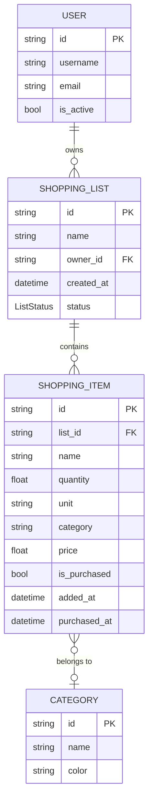

# Domain Model

## Entity Descriptions

| Entity | Responsibility |
|---|---|
| **User** | Represents an account. Owns one or more shopping lists. Validated: non-empty id/username, email must contain `@`. |
| **ShoppingList** | A named collection of items owned by one user. Status is either `ACTIVE` or `ARCHIVED`. Archived lists reject new items. |
| **ShoppingItem** | A single product on a list. Tracks name, quantity, optional unit/category/price, and purchase state (`is_purchased`, `purchased_at`). |
| **Category** | A label with a display colour that groups items. Associated loosely — an item's `category` field holds the name string. |

## Value Objects / Enums

| Type | Values | Used by |
|---|---|---|
| `ListStatus` | `ACTIVE`, `ARCHIVED` | `ShoppingList.status` |
| `SortOrder` | `ALPHABETICAL`, `CATEGORY`, `PRICE_ASC`, `PRICE_DESC`, `UNPURCHASED_FIRST` | `SortStrategyFactory` |
| `EventType` | `ITEM_ADDED`, `ITEM_REMOVED`, `LIST_COMPLETED` | `ItemEvent` |

## Key Invariants

- A `ShoppingItem` must have a positive `quantity` and a non-negative `price`.
- A `ShoppingList` with status `ARCHIVED` cannot receive new items.
- `LIST_COMPLETED` is fired only when the list is non-empty and every item is purchased.
