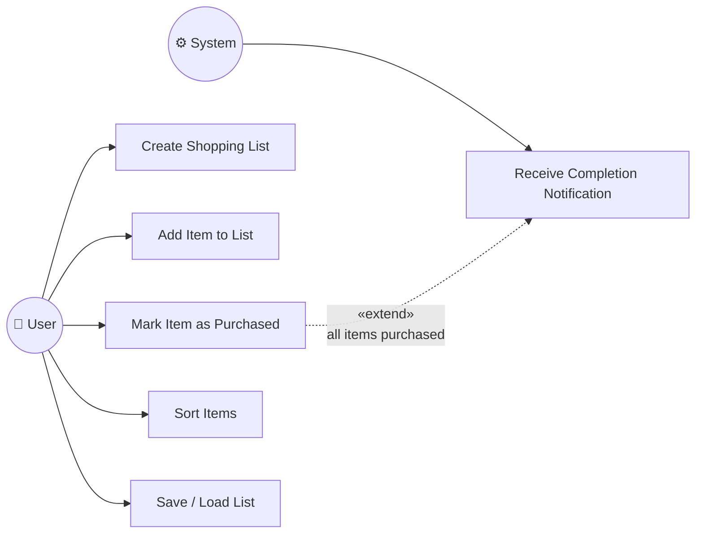

# Use Case Diagram

## Actors

| Actor | Description |
|---|---|
| **User** | Interacts with the shopping list: creates lists, manages items, sorts and marks purchases. |
| **System** | Reacts to domain events automatically — fires the completion notification when every item in a list is purchased. |

## Use Cases

### UC1 — Create Shopping List
**Actor:** User  
**Main Flow:**
1. User provides a list name and owner ID.
2. System creates the list with status `ACTIVE`.
3. System stores the list in the repository.

**Alternative Flow:**
- Empty or blank name → `ValueError` is raised; list is not created.

---

### UC2 — Add Item to List
**Actor:** User  
**Main Flow:**
1. User specifies a list ID, item name, quantity, and optional fields (unit, category, price).
2. System verifies the list exists and is `ACTIVE`.
3. System creates the item and stores it.
4. System fires an `ITEM_ADDED` event.

**Alternative Flows:**
- List not found → `ShoppingListNotFoundError`.
- List is `ARCHIVED` → `ListArchivedError`.
- Invalid item fields (empty name, non-positive quantity, negative price) → `ValueError`.

---

### UC3 — Mark Item as Purchased
**Actor:** User  
**Main Flow:**
1. User provides an item ID.
2. System sets `is_purchased = True` and records `purchased_at`.
3. System saves the updated item.

**Alternative Flows:**
- Item not found → `ShoppingItemNotFoundError`.
- Item already purchased → `ItemAlreadyPurchasedError`.

**Extension point (UC6):** if every remaining item in the list is now purchased, System fires `LIST_COMPLETED`.

---

### UC4 — Sort Items
**Actor:** User  
**Main Flow:**
1. User selects a sort order (alphabetical, by category, price ascending, price descending, unpurchased first).
2. System applies the corresponding `SortStrategy` to the list's items.
3. System returns the sorted list without mutating storage.

**Alternative Flow:**
- Unknown strategy name → `ValueError` from `SortStrategyFactory`.

---

### UC5 — Save / Load List
**Actor:** User  
**Main Flow (Save):**
1. User triggers a save.
2. `PersistenceService` checks if the list/item already exists in the repository.
3. If new → `add`; if existing → `update`.
4. `JsonFileShoppingListRepository` serialises state to a JSON file.

**Main Flow (Load):**
1. User requests a list or item by ID.
2. `PersistenceService` queries the repository and returns the object (or `None`).

**Alternative Flows:**
- JSON file is missing → repository starts empty (no error).
- JSON file is corrupt → `json.JSONDecodeError` is raised on startup.

---

### UC6 — Receive Completion Notification
**Actor:** System  
**Trigger:** All items in a list are purchased.  
**Main Flow:**
1. `ShoppingListService._check_completion` detects that every item is purchased.
2. System fires `LIST_COMPLETED` event via `ShoppingListSubject`.
3. `ListCompletionObserver` writes a message to `NotificationLog`.
4. User can retrieve the message via `NotificationService`.
